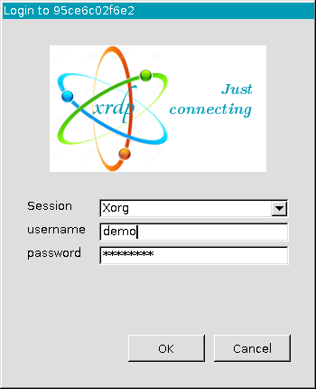

# ubuntu-docker-desktop-xrdp

The desktop docker container for an [RDP](https://en.wikipedia.org/wiki/Remote_Desktop_Protocol) client, based on Ubuntu 24.10 LTS, featuring a Windows-like appearance powered by the [XFCE](https://xfce.org) environment.
The home directory of the `demo` user inside the Docker container is persistent and is mapped to the `./home` directory on the host machine, ensuring data remains accessible between container restarts.
Audio support is not available.
The Docker image has a size of 980MB, including the Firefox web browser.

## Software Requirements

To install Docker Engine (CE), follow the instructions on the official [website](https://docs.docker.com/engine/install/).

## Build docker image, run container and open RDP client:

All necessary instructions are prepared by functions of the [init.sh](init.sh) bash script.

```bash
. init.sh # Load bash functions
dbuild    # Build docker image
drun      # Run container
dxrdp     # Open xfreerdp desktop client
dstop     # Stop container (and remove it)
```

To log in, use the following default user account details:

```bash
Username: demo
Password: changeit
```

## Screenshot of login prompt of `xfreerdp` application



## Screenshot of XFCE desktop


